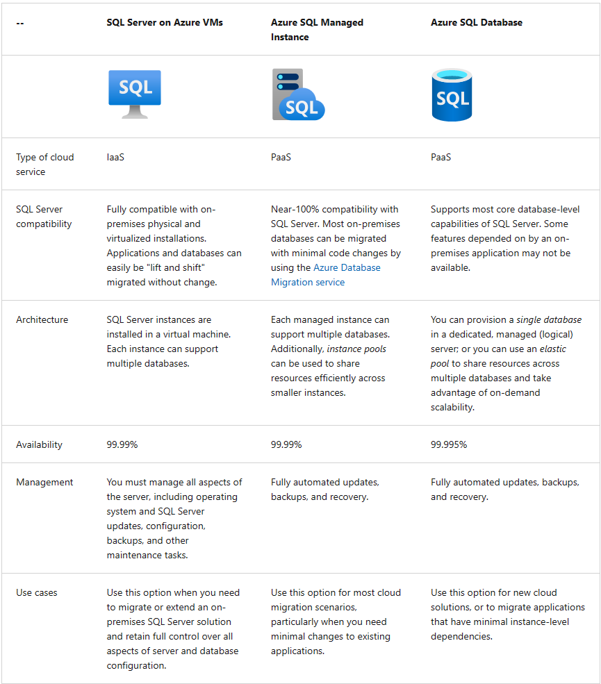
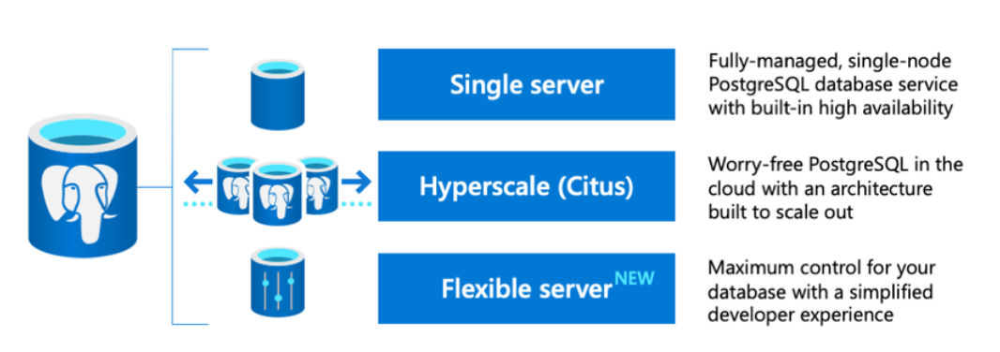
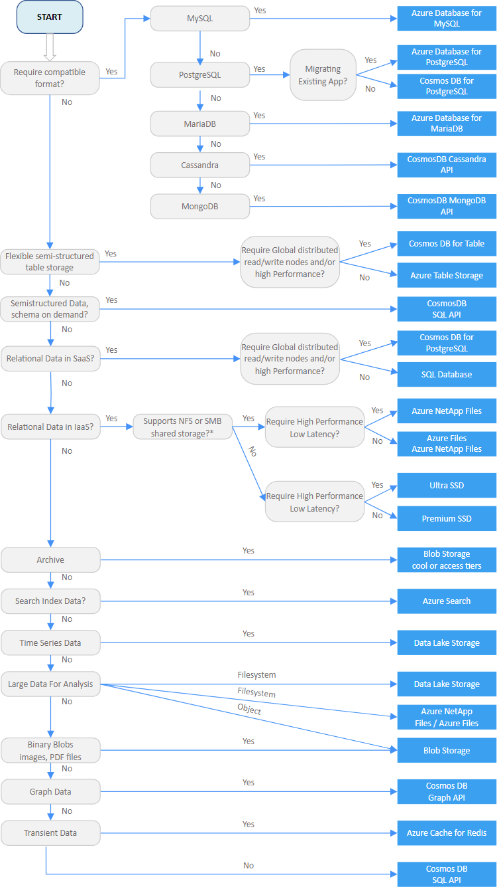

# Explore core data concepts
**Data structure (Entity, Attribute)**
## **Data classification**
- **Structured**
  - Fixed schema
  - Mostly tabular
  - Relational model
- **Semi-structured**
  - Has some structure
  - JSON
- **Unstructured**
  - Has no specific structure
  - Documents, images, audio & video data, binary files
## **Data Stores**
- **File stores**
  - Delimited text files (CSV, TSV, fixed-width)
  - JavaScript Object Notation (JSON) --- {Objects}, [Collections], Attributes --> name:value separated by comma
  - Extensible Markup Language (XML) --- <tags> --> define elements and attributes
  - Binary Large Object (Blob) --- Images, Video, Audio, Application-specific documents
  - Optimized file formats: Avro (Apache), ORC, Parquet (Cloudera & Twitter)

- **Databases**
  - Relational: Structured, Normalized, Pk, 
  - Non-relational (NoSQL): 
    - key-value databases
    - Document databases
    - Column family databases
    - Graph databases: Nodes, Edges
## Transactional Data Processing
- Online Transactional Processing (OLTP)
- Line of business (LOB) applications
- ACID semantics:
  - Atomicity
  - Consistency
  - Isolation
  - Durability
## Analytical Data Processing
- ETL
- Data warehouse, Data lake, Data lakehouse
- OLAP model (Cube) --> Measures, Dimensions
- Visualization and Dashboards

# Explore data Roles and Services
## Job Roles
- **Database Administrators**
  - Manage databases, data access permissions, data security, Backup/Restore
- **Data Engineers**
  - Manage infrastructure, integration processes, pipeline implementation 
- **Data Analysts**
  - Explore and analyze data, Data visualization
## Data Services
- **Azure SQL** ([Link](https://learn.microsoft.com/en-us/azure/azure-sql/azure-sql-iaas-vs-paas-what-is-overview?view=azuresql))
  - Azure SQL Database
  - Azure SQL managed Instance
  - Azure SQL VM
- **Azure Database for open-source relational databases**
  - Azure Database for MySQL
  - Azure Database for MariaDB
  - Azure Database for PostgreSQL
- **Azure Cosmos DB** (NoSQL) -- ([Link](https://learn.microsoft.com/en-us/azure/cosmos-db/))
  - Manage JSON, key-value pairs, column-families, Graphs
- **Azure Storage**
  - Blob containers, File shares, Tables (key-value), host data lakes
- **Azure Data Factory** ([Link](https://learn.microsoft.com/en-us/azure/data-factory/introduction))
  - ETL, Data pipelines
- **Azure Synapse Analytics** ([Link](https://learn.microsoft.com/en-us/azure/synapse-analytics/overview-what-is))
  - Unified PaaS solution for data analytics
  - **Capabilities:** Pipelines, SQL, Apache Spark, Azure Synapse Data Explore (KQL)
- **Azure Databricks** ([Link](https://learn.microsoft.com/en-us/azure/databricks/introduction/))
- **Azure HDInsight** ([Link](https://learn.microsoft.com/en-us/azure/hdinsight/hdinsight-overview))
  - **Azure hosted cluster for:** Apache Spark, Apache hadoop, Apache HBase, Apache Kafka
- **Azure Stream Analytics** ([Link](https://learn.microsoft.com/en-us/azure/stream-analytics/stream-analytics-introduction))
- **Azure Data Explorer** ([Link](https://learn.microsoft.com/en-us/azure/data-explorer/data-explorer-overview))
- **Microsoft Purview** ([Link](https://learn.microsoft.com/en-us/purview/purview))
  - Data governance and discoverability
- **Microsoft Fabric** ([Link](https://learn.microsoft.com/en-us/fabric/get-started/microsoft-fabric-overview))
  - Unified SaaS analytics platform
# Explore fundamental relational data concepts

### Relational Data
- Tables, Rows, Columns, Data Types, Pk, Fk, NULL
### Normalization (Simple definition)
1. Separate each entity into its own table. 
2. Separate each discrete attribute into its own column. 
3. Uniquely identify each entity instance (row) using a primary key. 
4. Use foreign key columns to link related entities.

### SQL
- Standardized by ANSI (1986) and ISO (1987)
- Dialects (Proprietary extensions) of SQL (T-SQL, PL/SQL, pgSQL)
- **SQL Statement Types**
  - Data Definition Language (DDL)
    - CREATE, ALTER, DROP, RENAME
  - Data Control Language (DCL)
    - GRANT, DENY, REVOKE
  - Data Manipulation Language (DML)
    - SELECT, INSERT, UPDATE, DELETE
### Database Objects
- View ([Link](https://learn.microsoft.com/en-us/sql/t-sql/statements/create-view-transact-sql?view=sql-server-ver16)), ([Link2](https://learn.microsoft.com/en-us/sql/relational-databases/views/views?view=sql-server-ver16))
- Stored Procedure ([Link](https://learn.microsoft.com/en-us/sql/t-sql/statements/create-procedure-transact-sql?view=sql-server-ver16&source=recommendations)), ([Link2](https://learn.microsoft.com/en-us/sql/relational-databases/stored-procedures/stored-procedures-database-engine?view=sql-server-ver16))
- Index ([Link](https://learn.microsoft.com/en-us/sql/t-sql/statements/create-index-transact-sql?view=sql-server-ver16)), ([Link2](https://learn.microsoft.com/en-us/sql/relational-databases/indexes/indexes?view=sql-server-ver16))
  - ```CREATE INDEX <index_name> ON <table_name>(<column_name>) ```

# Explore relational database services in Azure
- [SQL Server on Azure VM](https://learn.microsoft.com/en-us/azure/azure-sql/virtual-machines/windows/sql-server-on-azure-vm-iaas-what-is-overview?view=azuresql)
- [Azure SQL Managed Instance](https://learn.microsoft.com/en-us/azure/azure-sql/managed-instance/sql-managed-instance-paas-overview?view=azuresql)
- [Azure SQL Database](https://learn.microsoft.com/en-us/azure/azure-sql/database/sql-database-paas-overview?view=azuresql)
- [Azure SQL Edge](https://learn.microsoft.com/en-us/azure/azure-sql-edge/overview)
  - Single database
  - Elastic pool
### Compare Azure SQL Services


### Azure services for open-source databases
- [Azure database for MySQL](https://learn.microsoft.com/en-us/azure/mysql/)
  - Leading open source relational database for Linux, Apache, MySQL, and PHP (LAMP) stack apps.
  - 
- [Azure Database for MariaDB](https://learn.microsoft.com/en-us/azure/mariadb/)
  - One notable feature of MariaDB is its built-in support for temporal data.
  - MariaDB offers compatibility with Oracle Database.
  - A table can hold several versions of data, enabling an application to query the data as it appeared at some point in the past.
  
- [Azure Database for PostgreSQL](https://learn.microsoft.com/en-us/azure/postgresql/)
  - Hybrid relational-object database
  - Also enables you to store custom data types, with their own non-relational properties
  - Ability to store and manipulate geometric data, such as lines, circles, and polygons.
  - Deployment Options: 
  
# Explore Azure Storage for non-relational data
- [Azure blob storage](https://learn.microsoft.com/en-us/azure/storage/blobs/storage-blobs-introduction)
  - Store massive amounts of unstructured data as binary large objects (blobs)
  - A container provides a convenient way of grouping related blobs together. You control who can read and write blobs inside a container at the container level.
  - Folders are purely virtual, and you can't perform folder-level operations to control access or perform bulk operations.
  - Azure Blob Storage supports three different types of blob:
    - **Block Blobs**
      - Block blobs are best used to store discrete, large, binary objects that change infrequently.
    - **Page Blobs**
      - Azure uses page blobs to implement virtual disk storage for virtual machines.
    - **Append Blobs**
  - Blob storage provides three access tiers:
    - **Hot Tier (Default)**
    - **Cool Tier**
    - **Archive Tier**
- [Azure DataLake Storage Gen2](https://learn.microsoft.com/en-us/azure/storage/blobs/data-lake-storage-introduction)
  - Enable you to take advantage of the scalability of blob storage and the cost-control of storage tiers, combined with the hierarchical file system capabilities and compatibility with major analytics systems of Azure Data Lake Store.
  - To create an **Azure Data Lake Store Gen2** files system, you must enable the **Hierarchical Namespace** option of an Azure Storage account.
  - Upgrading is a one-way process – after upgrading a storage account to support a hierarchical namespace for blob storage, you can’t revert it to a flat namespace.
- [Azure Files](https://learn.microsoft.com/en-us/azure/storage/files/storage-files-introduction)
  - The maximum size of a single file is 1 TB, but you can set quotas to limit the size of each share below this figure.
  - You can upload files to Azure File Storage using the Azure portal, or tools such as the AzCopy utility.
  - Azure File Storage offers two performance tiers:
    - **Standard Tier** (uses hard disk-based hardware in a datacenter)
    - **Premium Tier** (uses solid-state disks)
  - Azure Files supports two common network file sharing protocols:
    - **Server Message Block (SMB)** file sharing is commonly used across multiple operating systems (Windows, Linux, macOS). 
    - **Network File System (NFS)** shares are used by some Linux and macOS versions. To create an NFS share, you must use a premium tier storage account and create and configure a virtual network through which access to the share can be controlled. 
- [Azure Tables](https://learn.microsoft.com/en-us/azure/storage/tables/table-storage-overview)
  - NoSQL, key/value, Semi-structured data, unique key (partition key + row key)
  - No concept of foreign keys, relationships, stored procedures, views, or other objects
  - Partitioning is a mechanism for grouping related rows, based on a common property or partition key. Rows that share the same partition key will be stored together. 
    - Partitions are independent from each other, and can grow or shrink as rows are added to, or removed from, a partition. A table can contain any number of partitions. 
    - When you search for data, you can include the partition key in the search criteria. This helps to narrow down the volume of data to be examined, and improves performance by reducing the amount of I/O (input and output operations, or reads and writes) needed to locate the data.
- [Select an Azure data store for your Application](https://learn.microsoft.com/en-us/azure/architecture/guide/technology-choices/data-store-decision-tree)
  - 

# Explore fundamentals of [Azure Cosmos DB](https://learn.microsoft.com/en-us/training/modules/explore-non-relational-data-stores-azure/)
- Azure Cosmos DB is a highly scalable cloud database service for NoSQL data.
- Support multiple APIs
- Uses indexes and partitioning to provide fast read and write performance
- You can enable multi-region writes, adding the Azure regions of your choice to your Cosmos DB account so that globally distributed users can each work with data in their local replica.
- Cosmos DB is highly suitable for:
  - **IoT and telematics**
  - **Retail and marketing**
  - **Gaming**
  - **Web and mobile applications**
- You can provision throughput at two granularities:
  - Azure Cosmos DB containers (throughput is exclusively reserved for that container)
  - Azure Cosmos DB databases - throughput is shared across all the containers (called shared database containers) in the database
- Azure Cosmos DB security:
  - **Network security** (IP-based access control, Approved set of Machines)
  - **Authorization** (hash-based message authentication code (HMAC))
  - **Active Directory integration** (Azure role-based access control)

# Explore fundamentals of large-scale analytics
## *Data Warehouse vs. Data Lake vs. Data Lakehouse*
[Link](https://www.striim.com/blog/data-warehouse-vs-data-lake-vs-data-lakehouse-an-overview/)

### **Conventional Data Warehouse:**
- Involves copying data from transactional data stores into a relational database with a schema that's optimized for querying and building multidimensional models.
- Schema, Star schema, Snowflake schema, Fact tables, Dimension tables
### **Data Lake:**
- Highly flexible storage repository that stores large amounts of structured and unstructured data in its raw, original, and unformatted form.
- File store, Schema-on-read, Spark/Hadoop, Delta Lake
### **Data Lakehouse / Lake Database:**
- Data lakehouse solutions are used with large volumes of data in multiple formats, which is batch loaded or captured in real-time streams and stored in a data lake from which distributed processing engines like Apache Spark are used to process it.
- Data lakehouse is a new, big-data storage architecture that combines the best features of both data warehouses and data lakes. 
- Data lakehouse enables a single repository for all your data (structured, semi-structured, and unstructured) while enabling best-in-class machine learning, business intelligence, and streaming capabilities.

#### **Comparison**


## **Data Ingestion Pipelines**
- Azure Data Factory ([Link](https://azure.microsoft.com/en-us/products/data-factory/))
- Azure Synapse Analytics ([Link](https://azure.microsoft.com/en-us/products/synapse-analytics/))
- Microsoft Fabric ([Link](https://learn.microsoft.com/en-us/fabric/data-factory/data-factory-overview))

## **PaaS Services to implement Large-scale Analytical Store**
- Azure Synapse Analytics ([Link](https://azure.microsoft.com/en-us/products/synapse-analytics/))
  - Synapse Analytics is a great choice when you want to create a single, unified analytics solution on Azure.
  - Azure Synapse Data Explorer
  - **Azure Synapse Studio**: web-based interface that you can use to work with your Synapse Analytics workspace.
  - A Synapse Analytics workspace requires two resource groups in your Azure subscription; one for resources you explicitly create, and another for managed resources used by the service. It also requires a Data Lake storage account in which to store data, scripts, and other artifacts.
- Azure Databricks ([Link](https://azure.microsoft.com/en-us/products/databricks/))
  - Built on **Apache Spark**, and offers native SQL capabilities as well as workload-optimized Spark clusters for data analytics and data science.
- Azure HDInsight ([Link](https://azure.microsoft.com/en-us/products/hdinsight/))
  - Supports multiple open-source data analytics cluster types
## **SaaS Service for scalable data analytics**
- Microsoft Fabric ([Link](https://www.microsoft.com/en-us/microsoft-fabric))
  - Fabric is a unified software-as-a-service (SaaS) offering, with all your data stored in a single open format in OneLake.
  - **OneLake**: 
    - OneLake is Fabric's lake-centric architecture that provides a single, integrated environment for data professionals and the business to collaborate on data projects.
    - OneLake combines storage locations across different regions and clouds into a single logical lake, without moving or duplicating data.

# Explore fundamentals of real-time analytics
### Data Processing:
- Conversion of **raw data** to **meaningful information** through a **process**.
### Batch Processing:
- Group of data based on:
  - Scheduled time interval (Hourly, Daily, Monthly, ...)
  - Certain amount of data (Size)
  - Event result
- Advantage:
  - Large volume at convenient time
  - Scheduled execution (effective resource utilization)
- Disadvantage:
  - Delay
  - Pron to minor errors
### Stream Processing:
- Ideal for time-critical operations
- Near real-time processing
- New, dynamic data is generated on a continual basis.

### Comparison
- **Data scope**: Batch processing can process all the data in the dataset. Stream processing typically only has access to the most recent data received, or within a rolling time window (the last 30 seconds, for example).
- **Data size**: Batch processing is suitable for handling large datasets efficiently. Stream processing is intended for individual records or micro batches consisting of few records.
- **Performance**: Latency is the time taken for the data to be received and processed. The latency for batch processing is typically a few hours. Stream processing typically occurs immediately, with latency in the order of seconds or milliseconds.
- **Analysis**: You typically use batch processing to perform complex analytics. Stream processing is used for simple response functions, aggregates, or calculations such as rolling averages.
### Combined batch and stream data processing Architecture
- Lambda
- Delta

## Real-time analytics in Azure
- **Azure Stream Analytics (PaaS)** [[Link](https://azure.microsoft.com/en-us/products/stream-analytics)]
  - Stream Analysis Job
  - Stream Analysis Cluster
  - Exercise: ([Launch](https://microsoftlearning.github.io/DP-900T00A-Azure-Data-Fundamentals/Instructions/Labs/dp900-05-stream-lab.html))
- **Spark Structured Streaming (Open-source library)** [[Link](https://learn.microsoft.com/en-us/azure/hdinsight/spark/apache-spark-structured-streaming-overview)]
  - Spark Structured Streaming library
  - Can be used with:
    - Azure Synapse Analytics 
    - Azure Databricks 
    - Azure HDInsight
  - Built on Dataframe
  - Delta Lake ([Link](https://docs.delta.io/latest/delta-intro.html))
  - **Exercise** ([Launch](https://microsoftlearning.github.io/DP-900T00A-Azure-Data-Fundamentals/Instructions/Labs/dp900-05a-stream-with-spark.html))
- **Azure Data Explorer (high-performance database and analytics service)** [[Link](https://learn.microsoft.com/en-us/azure/data-explorer/data-explorer-overview)]

## Sources for stream processing
- **Azure Event Hubs**: ([Link](https://learn.microsoft.com/en-us/azure/event-hubs/event-hubs-features))
- **Azure IoT Hub**: ([Link](https://azure.microsoft.com/en-us/products/iot-hub/))
- **Azure Data Lake Store Gen 2**: ([Link](https://learn.microsoft.com/en-us/azure/storage/blobs/data-lake-storage-introduction))
- **Apache Kafka**: ([Link](https://learn.microsoft.com/en-us/azure/event-hubs/azure-event-hubs-kafka-overview))

## Sinks for stream processing
- **Azure Event Hubs** ([Link](https://learn.microsoft.com/en-us/azure/event-hubs/event-hubs-features))
- **Azure Data Lake Store Gen 2 or Azure blob storage ([Link](https://learn.microsoft.com/en-us/azure/storage/blobs/storage-blobs-introduction))**
- **Azure SQL Database ([Link](https://learn.microsoft.com/en-us/azure/azure-sql/database/sql-database-paas-overview?view=azuresql)) or Azure Synapse Analytics ([Link](https://learn.microsoft.com/en-us/azure/synapse-analytics/overview-what-is)), or Azure Databricks ([Link](https://learn.microsoft.com/en-us/azure/databricks/))**
- **Microsoft Power BI** ([Link](https://learn.microsoft.com/en-us/power-bi/fundamentals/power-bi-overview))

# Explore fundamentals of data visualization

### Business Intelligence (BI) [[Link](https://powerbi.microsoft.com/en-us/what-is-business-intelligence/)]
## Microsoft Power BI ([Link1](https://learn.microsoft.com/en-us/power-bi/fundamentals/power-bi-overview)), ([Link2](https://learn.microsoft.com/en-us/power-bi/fundamentals/desktop-getting-started)), ([Link3](https://learn.microsoft.com/en-us/training/paths/model-data-power-bi/))
- **Power BI Desktop**
- **Power BI Service**
- **Power BI Phone App**
#### Data Modeling Concepts
- **Analytical Models**
- **Measures**
- **Dimensions**
- **Multidimensional structure (Cube)**
- **Schema (Star/Snowflake)**
- **Attribute Hierarchies(Drill-up/Drill-down)**
#### Data Visualization
- **Tables and Text**
- **Bar and column charts**
- **Line Charts**
- **Pie Charts**
- **Scatter Plots**
- **Maps**
#### Exercise ([Launch](https://microsoftlearning.github.io/DP-900T00A-Azure-Data-Fundamentals/Instructions/Labs/dp900-pbi-06-lab.html))
