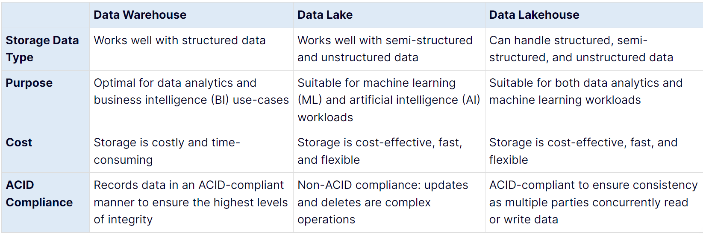

# Explore fundamentals of large-scale analytics
## *Data Warehouse vs. Data Lake vs. Data Lakehouse*
[Link](https://www.striim.com/blog/data-warehouse-vs-data-lake-vs-data-lakehouse-an-overview/)

### **Conventional Data Warehouse:**
- Involves copying data from transactional data stores into a relational database with a schema that's optimized for querying and building multidimensional models.
- Schema, Star schema, Snowflake schema, Fact tables, Dimension tables
### **Data Lake:**
- Highly flexible storage repository that stores large amounts of structured and unstructured data in its raw, original, and unformatted form.
- File store, Schema-on-read, Spark/Hadoop, Delta Lake
### **Data Lakehouse / Lake Database:**
- Data lakehouse solutions are used with large volumes of data in multiple formats, which is batch loaded or captured in real-time streams and stored in a data lake from which distributed processing engines like Apache Spark are used to process it.
- Data lakehouse is a new, big-data storage architecture that combines the best features of both data warehouses and data lakes. 
- Data lakehouse enables a single repository for all your data (structured, semi-structured, and unstructured) while enabling best-in-class machine learning, business intelligence, and streaming capabilities.

#### **Comparison**

## **Data Ingestion Pipelines**
- Azure Data Factory ([Link](https://azure.microsoft.com/en-us/products/data-factory/))
- Azure Synapse Analytics ([Link](https://azure.microsoft.com/en-us/products/synapse-analytics/))
- Microsoft Fabric ([Link](https://learn.microsoft.com/en-us/fabric/data-factory/data-factory-overview))

## **PaaS Services to implement Large-scale Analytical Store**
- Azure Synapse Analytics ([Link](https://azure.microsoft.com/en-us/products/synapse-analytics/))
  - Synapse Analytics is a great choice when you want to create a single, unified analytics solution on Azure.
  - Azure Synapse Data Explorer
  - **Azure Synapse Studio**: web-based interface that you can use to work with your Synapse Analytics workspace.
  - A Synapse Analytics workspace requires two resource groups in your Azure subscription; one for resources you explicitly create, and another for managed resources used by the service. It also requires a Data Lake storage account in which to store data, scripts, and other artifacts.
- Azure Databricks ([Link](https://azure.microsoft.com/en-us/products/databricks/))
  - Built on **Apache Spark**, and offers native SQL capabilities as well as workload-optimized Spark clusters for data analytics and data science.
- Azure HDInsight ([Link](https://azure.microsoft.com/en-us/products/hdinsight/))
  - Supports multiple open-source data analytics cluster types
## **SaaS Service for scalable data analytics**
- Microsoft Fabric ([Link](https://www.microsoft.com/en-us/microsoft-fabric))
  - Fabric is a unified software-as-a-service (SaaS) offering, with all your data stored in a single open format in OneLake.
  - **OneLake**: 
    - OneLake is Fabric's lake-centric architecture that provides a single, integrated environment for data professionals and the business to collaborate on data projects.
    - OneLake combines storage locations across different regions and clouds into a single logical lake, without moving or duplicating data.

# Explore fundamentals of real-time analytics
### Data Processing:
- Conversion of **raw data** to **meaningful information** through a **process**.
### Batch Processing:
- Group of data based on:
  - Scheduled time interval (Hourly, Daily, Monthly, ...)
  - Certain amount of data (Size)
  - Event result
- Advantage:
  - Large volume at convenient time
  - Scheduled execution (effective resource utilization)
- Disadvantage:
  - Delay
  - Pron to minor errors
### Stream Processing:
- Ideal for time-critical operations
- Near real-time processing
- New, dynamic data is generated on a continual basis.

### Comparison
- **Data scope**: Batch processing can process all the data in the dataset. Stream processing typically only has access to the most recent data received, or within a rolling time window (the last 30 seconds, for example).
- **Data size**: Batch processing is suitable for handling large datasets efficiently. Stream processing is intended for individual records or micro batches consisting of few records.
- **Performance**: Latency is the time taken for the data to be received and processed. The latency for batch processing is typically a few hours. Stream processing typically occurs immediately, with latency in the order of seconds or milliseconds.
- **Analysis**: You typically use batch processing to perform complex analytics. Stream processing is used for simple response functions, aggregates, or calculations such as rolling averages.
### Combined batch and stream data processing Architecture
- Lambda
- Delta

## Real-time analytics in Azure
- **Azure Stream Analytics (PaaS)** [[Link](https://azure.microsoft.com/en-us/products/stream-analytics)]
  - Stream Analysis Job
  - Stream Analysis Cluster
  - Exercise: ([Launch](https://microsoftlearning.github.io/DP-900T00A-Azure-Data-Fundamentals/Instructions/Labs/dp900-05-stream-lab.html))
- **Spark Structured Streaming (Open-source library)** [[Link](https://learn.microsoft.com/en-us/azure/hdinsight/spark/apache-spark-structured-streaming-overview)]
  - Spark Structured Streaming library
  - Can be used with:
    - Azure Synapse Analytics 
    - Azure Databricks 
    - Azure HDInsight
  - Built on Dataframe
  - Delta Lake ([Link](https://docs.delta.io/latest/delta-intro.html))
  - **Exercise** ([Launch](https://microsoftlearning.github.io/DP-900T00A-Azure-Data-Fundamentals/Instructions/Labs/dp900-05a-stream-with-spark.html))
- **Azure Data Explorer (high-performance database and analytics service)** [[Link](https://learn.microsoft.com/en-us/azure/data-explorer/data-explorer-overview)]

## Sources for stream processing
- **Azure Event Hubs**: ([Link](https://learn.microsoft.com/en-us/azure/event-hubs/event-hubs-features))
- **Azure IoT Hub**: ([Link](https://azure.microsoft.com/en-us/products/iot-hub/))
- **Azure Data Lake Store Gen 2**: ([Link](https://learn.microsoft.com/en-us/azure/storage/blobs/data-lake-storage-introduction))
- **Apache Kafka**: ([Link](https://learn.microsoft.com/en-us/azure/event-hubs/azure-event-hubs-kafka-overview))

## Sinks for stream processing
- **Azure Event Hubs** ([Link](https://learn.microsoft.com/en-us/azure/event-hubs/event-hubs-features))
- **Azure Data Lake Store Gen 2 or Azure blob storage ([Link](https://learn.microsoft.com/en-us/azure/storage/blobs/storage-blobs-introduction))**
- **Azure SQL Database ([Link](https://learn.microsoft.com/en-us/azure/azure-sql/database/sql-database-paas-overview?view=azuresql)) or Azure Synapse Analytics ([Link](https://learn.microsoft.com/en-us/azure/synapse-analytics/overview-what-is)), or Azure Databricks ([Link](https://learn.microsoft.com/en-us/azure/databricks/))**
- **Microsoft Power BI** ([Link](https://learn.microsoft.com/en-us/power-bi/fundamentals/power-bi-overview))
- 