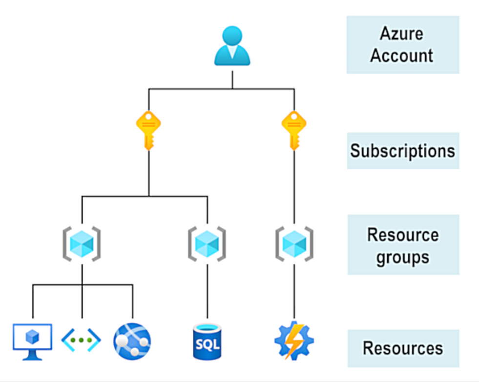
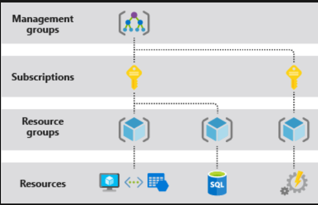
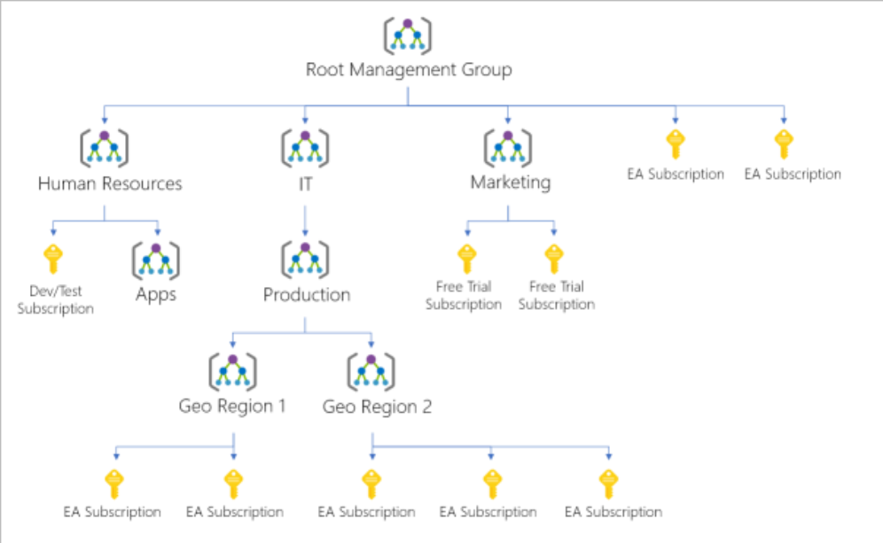
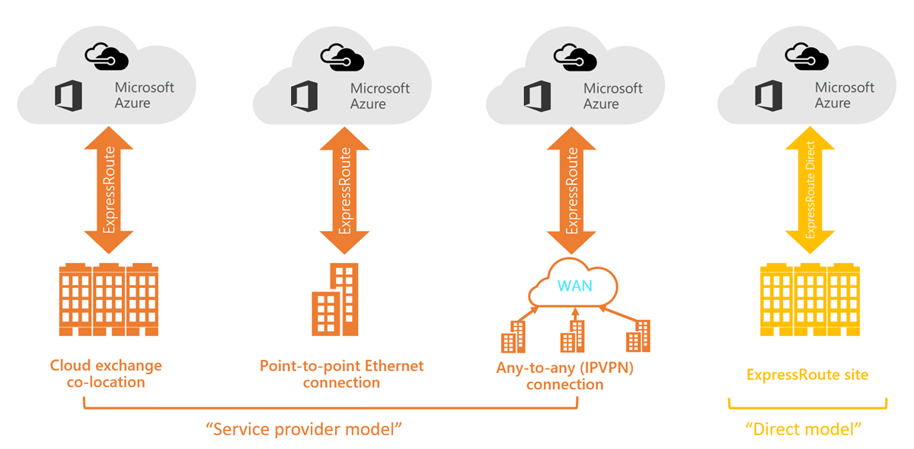
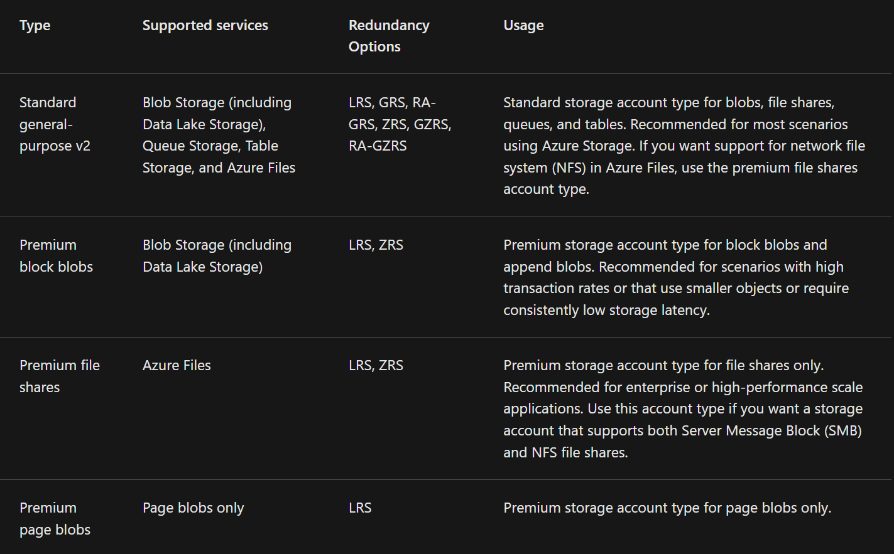
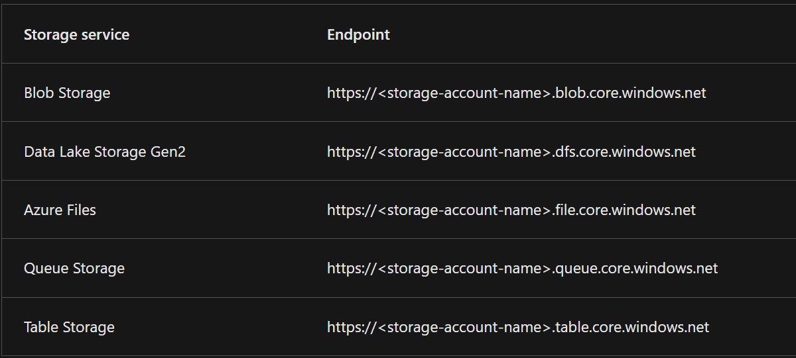
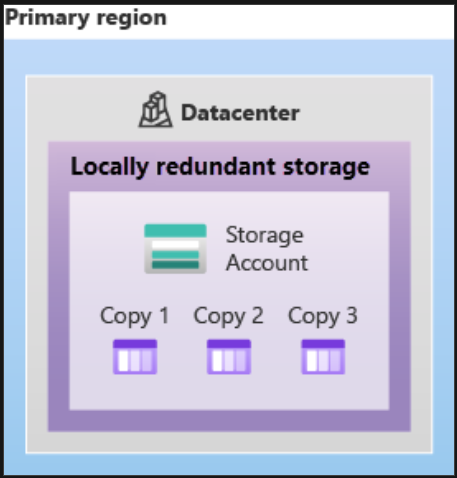
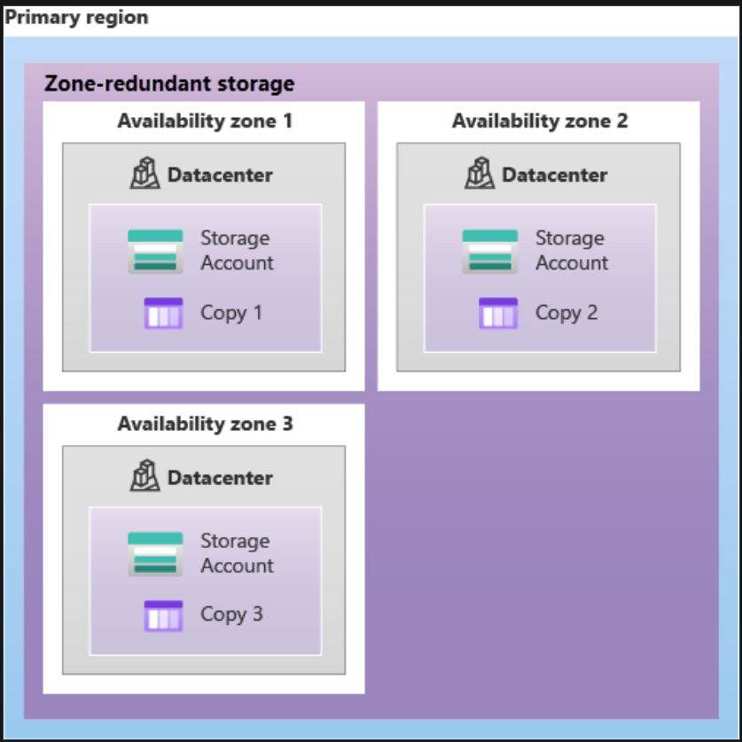
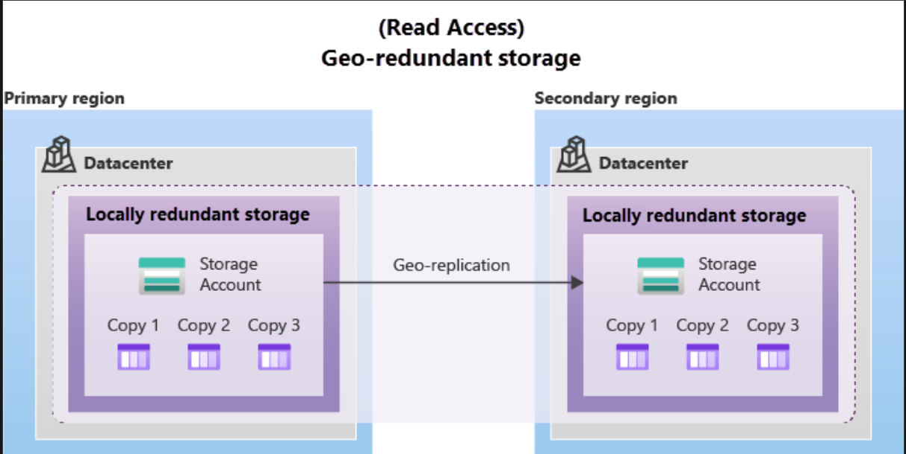
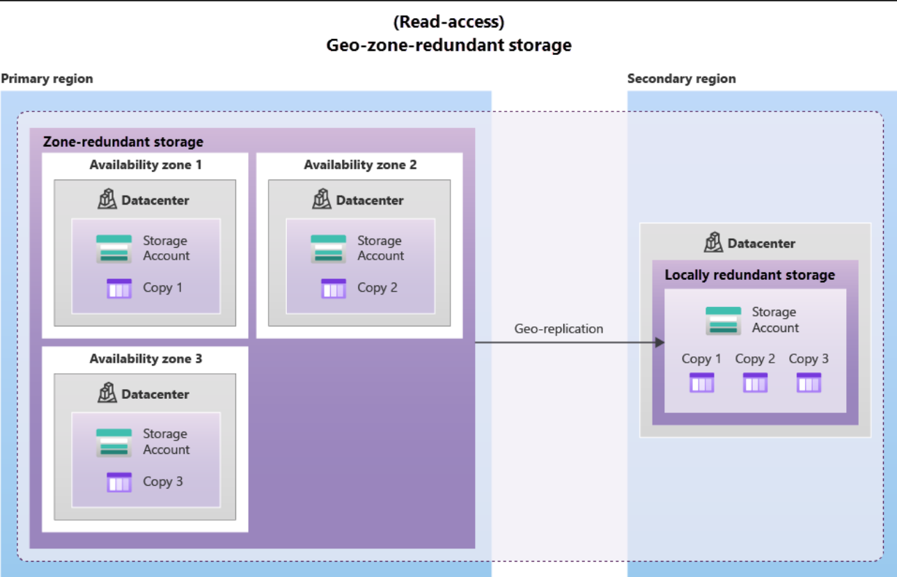

# [Describe cloud computing](https://learn.microsoft.com/en-us/training/modules/describe-cloud-compute/)
## [Shared Responsibility Model](https://learn.microsoft.com/en-us/azure/security/fundamentals/shared-responsibility)

## [Cloud Models](https://azure.microsoft.com/en-us/resources/cloud-computing-dictionary/what-are-private-public-hybrid-clouds/)
- [Private Cloud](https://azure.microsoft.com/en-us/resources/cloud-computing-dictionary/what-is-a-private-cloud)
- [Public Cloud](https://cloud.google.com/learn/what-is-public-cloud)
- [Hybrid Cloud](https://azure.microsoft.com/en-us/resources/cloud-computing-dictionary/what-is-hybrid-cloud-computing/)

### [Multi-cloud](https://azure.microsoft.com/en-us/resources/cloud-computing-dictionary/what-is-multi-cloud)
### [Azure Arc](https://learn.microsoft.com/en-us/azure/azure-arc/)
### [Azure VMware Solution](https://learn.microsoft.com/en-us/azure/azure-vmware/introduction)

## [Consumption-based model](https://www.techtarget.com/searchcloudcomputing/definition/consumption-based-pricing-model)
- **[Capital expenditure (CapEx)](https://www.azureguru.org/capex-vs-opex/)**
- **[Operational expenditure (OpEx)](https://www.azureguru.org/capex-vs-opex/)**
- Advantages of Consumption-based model:
  - No upfront costs. 
  - No need to purchase and manage costly infrastructure that users might not use to its fullest potential. 
  - The ability to pay for more resources when they're needed. 
  - The ability to stop paying for resources that are no longer needed.
- [Pay-as-you-go pricing model](https://learn.microsoft.com/en-us/power-platform/admin/pay-as-you-go-overview)

# [Describe the benefits of using cloud services](https://learn.microsoft.com/en-us/training/modules/describe-benefits-use-cloud-services/)
## [High availability](https://learn.microsoft.com/en-us/azure/architecture/example-scenario/infrastructure/iaas-high-availability-disaster-recovery)
- [SLAs](https://www.microsoft.com/licensing/docs/view/Service-Level-Agreements-SLA-for-Online-Services)
- Available when needed
## [Scalability](https://azure.microsoft.com/en-us/resources/cloud-computing-dictionary/scaling-out-vs-scaling-up/)
- Vertical Scaling
- Horizontal Scaling
## [Reliability](https://learn.microsoft.com/en-us/azure/reliability/overview)
## Predictability
- Performance Predictability
  - Autoscaling, load balancing, high availability 
- Cost Predictability
  -  Total Cost of Ownership (TCO), Pricing Calculator
## Security and Governance
## Manageability

# [Describe cloud service types](https://learn.microsoft.com/en-us/training/modules/describe-cloud-service-types/)
[Shared Responsibility Model](https://learn.microsoft.com/en-us/azure/security/fundamentals/shared-responsibility)

- [IaaS](https://azure.microsoft.com/en-us/resources/cloud-computing-dictionary/what-is-iaas/)
- [PaaS](https://azure.microsoft.com/en-us/resources/cloud-computing-dictionary/what-is-paas/)
- [SaaS](https://azure.microsoft.com/en-us/resources/cloud-computing-dictionary/what-is-saas/)

# [Describe the core architectural components of Azure](https://learn.microsoft.com/en-us/training/modules/describe-core-architectural-components-of-azure/)
- [Azure accounts](https://learn.microsoft.com/en-us/dotnet/azure/create-azure-account)
  - 

### [Exercise - Explore the Learn sandbox](https://learn.microsoft.com/en-us/training/modules/describe-core-architectural-components-of-azure/4-exercise-explore-learn-sandbox)
- [Azure Cloud Shell](https://learn.microsoft.com/en-us/azure/cloud-shell/overview)
  - **PowerShell** command line interface (CLI) mode --> Default
  - Most Azure specific commands will start with the letters **az**.
  - If you’re more familiar with **BASH**, you can use BASH command instead by shifting to the BASH CLI.
  - To switch between Bash and PowerShell CLI use **bash** and **pwsh** commands.
  - Another way to interact is using the [Azure CLI](https://learn.microsoft.com/en-us/cli/azure/get-started-tutorial-0-before-you-begin) interactive mode. This changes CLI behavior to more closely resemble an integrated development environment (IDE).
  -  Interactive mode provides autocompletion, command descriptions, and even examples. If you’re unfamiliar with BASH and PowerShell, but want to use the command line, interactive mode may help you.
  - To enter and leave **Interactive Mode / Azure CLI** use **az interactive** and **exit** respectively. 
- [Azure Portal](https://learn.microsoft.com/en-us/azure/azure-portal/azure-portal-overview) 
  - Web interface

## [Azure physical infrastructure](https://learn.microsoft.com/en-us/training/modules/describe-core-architectural-components-of-azure/5-describe-azure-physical-infrastructure)
- [Azure Global Infrastructure](https://azure.microsoft.com/en-in/explore/global-infrastructure/)
- [Datacenter](https://datacenters.microsoft.com/)
- [Regions](https://learn.microsoft.com/en-us/azure/virtual-machines/regions)
  - Some services or virtual machine (VM) features are only available in certain regions, such as specific VM sizes or storage types. 
  - There are also some global Azure services that don't require you to select a particular region, such as Microsoft Entra ID, Azure Traffic Manager, and Azure DNS.
- [Availability Zones](https://learn.microsoft.com/en-us/azure/reliability/availability-zones-overview?tabs=azure-cli)
  - Physically separate datacenters within an Azure region.
  - Equipped with independent power, cooling, and networking.
  - Set up to be an isolation boundary.
  - **To ensure resiliency, a minimum of three separate availability zones are present in all availability zone-enabled regions. However, not all Azure Regions currently support availability zones.**
  - Availability zones are primarily for VMs, managed disks, load balancers, and SQL databases.
  - Azure services that support availability zones fall into three categories:
    - **Zonal services**: You pin the resource to a specific zone (for example, VMs, managed disks, IP addresses). 
    - **Zone-redundant services**: The platform replicates automatically across zones (for example, zone-redundant storage, SQL Database). 
    - **Non-regional services**: Services are always available from Azure geographies and are resilient to zone-wide outages as well as region-wide outages.
- [Region pairs](https://learn.microsoft.com/en-us/azure/reliability/cross-region-replication-azure)
  - Most Azure regions are paired with another region within the same geography (such as US, Europe, or Asia) at least 300 miles away.
  -  This approach allows for the replication of resources across a geography that helps reduce the likelihood of interruptions because of events such as natural disasters, civil unrest, power outages, or physical network outages that affect an entire region.
  - Not all Azure services automatically replicate data or automatically fall back from a failed region to cross-replicate to another enabled region. In these scenarios, recovery and replication must be configured by the customer.
  - **Most regions are paired in two directions, meaning they are the backup for the region that provides a backup for them (West US and East US back each other up). However, some regions, such as West India and Brazil South, are paired in only one direction. In a one-direction pairing, the Primary region does not provide backup for its secondary region. So, even though West India’s secondary region is South India, South India does not rely on West India. West India's secondary region is South India, but South India's secondary region is Central India. Brazil South is unique because it's paired with a region outside of its geography. Brazil South's secondary region is South Central US. The secondary region of South Central US isn't Brazil South.**
- [Sovereign Regions](https://learn.microsoft.com/en-us/azure/cloud-adoption-framework/ready/azure-setup-guide/regions)
  - Sovereign regions are instances of Azure that are isolated from the main instance of Azure. 
  - You may need to use a sovereign region for compliance or legal purposes.
  - Azure sovereign regions include:
    - US DoD Central, US Gov Virginia, US Gov Iowa and more: These regions are physical and logical network-isolated instances of Azure for U.S. government agencies and partners. These datacenters are operated by screened U.S. personnel and include additional compliance certifications. 
    - China East, China North, and more: These regions are available through a unique partnership between Microsoft and 21Vianet, whereby Microsoft doesn't directly maintain the datacenters.
## [Azure management infrastructure]()
- [Azure Management Scop](https://learn.microsoft.com/en-us/azure/azure-resource-manager/management/overview)
- [Azure resources](https://azure.microsoft.com/en-in/resources/)
  - Anything you create, provision, deploy, etc. is a resource. Virtual Machines (VMs), virtual networks, databases, cognitive services, etc. are all considered resources within Azure.
- [Resource Group](https://www.c-sharpcorner.com/blogs/what-is-azure-resource-and-resource-group)
  - While a resource group can contain many resources, a single resource can only be in one resource group at a time.
  - Resource groups can't be nested
  - When you apply an action to a resource group, that action will apply to all the resources within the resource group.
  - There aren’t hard rules about how you use resource groups, so consider how to set up your resource groups to maximize their usefulness for you.
- [Azure subscriptions](https://learn.microsoft.com/en-us/azure/cloud-adoption-framework/ready/considerations/fundamental-concepts)
  - Subscriptions are a unit of management, billing, and scale.
  - A subscription provides you with authenticated and authorized access to Azure products and services.
  - In a multi-subscription account, you can use the subscriptions to configure different billing models and apply different access-management policies.
  - There are two types of subscription boundaries that you can use:
    - **Billing boundary**: This subscription type determines how an Azure account is billed for using Azure. You can create multiple subscriptions for different types of billing requirements. Azure generates separate billing reports and invoices for each subscription so that you can organize and manage costs. 
    - **Access control boundary**: Azure applies access-management policies at the subscription level, and you can create separate subscriptions to reflect different organizational structures. An example is that within a business, you have different departments to which you apply distinct Azure subscription policies. This billing model allows you to manage and control access to the resources that users provision with specific subscriptions.
- [Azure management groups](https://learn.microsoft.com/en-us/azure/governance/management-groups/overview)
  -  You organize subscriptions into containers called management groups and apply governance conditions to the management groups.
  - All subscriptions within a management group automatically inherit the conditions applied to the management group, the same way that resource groups inherit settings from subscriptions and resources inherit from resource groups. 
  - Management groups can be nested.
  - Important facts about management groups:
    - 10,000 management groups can be supported in a single directory. 
    - A management group tree can support up to six levels of depth. This limit doesn't include the root level or the subscription level. 
    - Each management group and subscription can support only one parent.

# [Describe Azure compute and networking services](https://learn.microsoft.com/en-us/training/modules/describe-azure-compute-networking-services/)
## [Azure virtual machines](https://learn.microsoft.com/en-us/azure/virtual-machines/overview)
- An **image** is a template used to create a VM and may already include an OS and other software, like development tools or web hosting environments.
### [Virtual machine scale sets](https://learn.microsoft.com/en-us/azure/virtual-machine-scale-sets/?source=recommendations)
- Group of identical, load-balanced VMs.
- Scale sets allow you to centrally manage, configure, and update a large number of VMs in minutes.
- The number of VM instances can automatically increase or decrease in response to demand, or you can set it to scale based on a defined schedule. 
- Virtual machine scale sets also automatically deploy a **load balancer** to make sure that your resources are being used efficiently.
- With virtual machine scale sets, you can build large-scale services for areas such as compute, big data, and container workloads.

### [Virtual machine availability sets](https://learn.microsoft.com/en-us/azure/virtual-machines/availability-set-overview)
- Availability sets are designed to ensure that VMs stagger updates and have varied power and network connectivity, preventing you from losing all your VMs with a single network or power failure.
- Availability sets do this by grouping VMs in two ways:
  - **Update domain**: The update domain groups VMs that can be rebooted at the same time. This allows you to apply updates while knowing that only one update domain grouping will be offline at a time. All of the machines in one update domain will be updated. An update group going through the update process is given a 30-minute time to recover before maintenance on the next update domain starts. 
  - **Fault domain**: The fault domain groups your VMs by common power source and network switch. By default, an availability set will split your VMs across up to three fault domains. This helps protect against a physical power or networking failure by having VMs in different fault domains (thus being connected to different power and networking resources).
- There’s no additional cost for configuring an availability set

## [Exercise - Create an Azure virtual machine](https://learn.microsoft.com/en-us/training/modules/describe-azure-compute-networking-services/3-exercise-create-azure-virtual-machine)
## [Azure virtual desktop](https://learn.microsoft.com/en-us/azure/virtual-desktop/overview)
- Azure Virtual Desktop is a desktop and application virtualization service that runs on the cloud. 
- It enables you to use a cloud-hosted version of Windows from any location. 
- Azure Virtual Desktop works across devices and operating systems, and works with apps that you can use to access remote desktops or most modern browsers.

## [Azure containers](https://learn.microsoft.com/en-us/azure/container-apps/start-containers)
- You can run multiple containers on a single physical or virtual host. 
- Unlike virtual machines, you don't manage the operating system for a container. 
- Virtual machines appear to be an instance of an operating system that you can connect to and manage. Containers are lightweight and designed to be created, scaled out, and stopped dynamically.
- VMs virtualize the hardware while Containers virtualize the OS.
## [Azure functions](https://learn.microsoft.com/en-us/azure/azure-functions/functions-overview)
- Azure Functions is an event-driven, serverless compute option that doesn’t require maintaining virtual machines or containers.
- With Azure Functions, an event wakes the function, alleviating the need to keep resources provisioned when there are no events.
- Functions are commonly used when you need to perform work in response to an event (often via a REST request), timer, or message from another Azure service, and when that work can be completed quickly, within seconds or less.
- Azure Functions runs your code when it's triggered and automatically deallocates resources when the function is finished.
- Functions can be either stateless or stateful:
  - When they're stateless (the default), they behave as if they're restarted every time they respond to an event. 
  - When they're stateful (called Durable Functions), a context is passed through the function to track prior activity.
## [Azure App Service](https://learn.microsoft.com/en-us/azure/app-service/overview)
- App Service enables you to build and host web apps, background jobs, mobile back-ends, and RESTful APIs in the programming language of your choice without managing infrastructure.
- It enables automated deployments from GitHub, Azure DevOps, or any Git repo to support a continuous deployment model.
- Azure App Service is an HTTP-based service for hosting web applications, REST APIs, and mobile back ends. It supports multiple languages, including .NET, .NET Core, Java, Ruby, Node.js, PHP, or Python. It also supports both Windows and Linux environments.
- Types of App Services:
  - Web apps 
  - API apps 
  - WebJobs 
  - Mobile apps

## [Azure virtual networking](https://learn.microsoft.com/en-us/azure/virtual-network/virtual-networks-overview)
- Azure virtual networks provide the following key networking capabilities:
  - Isolation and segmentation 
  - Internet communications 
    - Assigning a [public IP address](https://phoenixnap.com/kb/public-vs-private-ip-address) to an Azure resource
    - Putting the resource behind a [public load balancer](https://learn.microsoft.com/en-us/azure/load-balancer/quickstart-load-balancer-standard-public-portal)
  - Communicate between Azure resources 
  - Communicate with on-premises resources 
    - [Point-to-site virtual private network](https://learn.microsoft.com/en-us/azure/vpn-gateway/point-to-site-about)
    - [Site-to-site virtual private networks](https://learn.microsoft.com/en-us/azure/vpn-gateway/tutorial-site-to-site-portal)
    - [Azure ExpressRoute](https://learn.microsoft.com/en-us/azure/expressroute/)
  - Route network traffic 
    - [Route Tables](https://www.geeksforgeeks.org/routing-tables-in-computer-network/)
    - [Border Gateway Protocol (BGP)](https://www.enterprisenetworkingplanet.com/standards-protocols/bgp-routing/)
  - Filter network traffic 
    - [Network security groups](https://learn.microsoft.com/en-us/azure/virtual-network/network-security-groups-overview)
    - [Network Virtual Appliances](https://learn.microsoft.com/en-us/azure/virtual-wan/about-nva-hub)
  - Connect virtual networks
    - [Virtual network peering](https://learn.microsoft.com/en-us/azure/virtual-network/virtual-network-peering-overview)
## [Exercise - Configure network access](https://learn.microsoft.com/en-us/training/modules/describe-azure-compute-networking-services/9-exercise-configure-network-access)
## [Azure virtual private networks](https://learn.microsoft.com/en-us/training/modules/describe-azure-compute-networking-services/10-virtual-private-networks)
- A virtual private network (VPN) uses an encrypted tunnel within another network. 
- VPNs are typically deployed to connect two or more trusted private networks to one another over an untrusted network (typically the public internet). 
- Traffic is encrypted while traveling over the untrusted network to prevent eavesdropping or other attacks. 
- VPNs can enable networks to safely and securely share sensitive information.

### [VPN gateways](https://learn.microsoft.com/en-us/azure/vpn-gateway/vpn-gateway-about-vpngateways)
- Azure VPN Gateway instances are deployed in a dedicated subnet of the virtual network and enable the following connectivity:
  - Connect on-premises datacenters to virtual networks through a site-to-site connection. 
  - Connect individual devices to virtual networks through a point-to-site connection. 
  - Connect virtual networks to other virtual networks through a network-to-network connection.
- You can deploy only one VPN gateway in each virtual network. However, you can use one gateway to connect to multiple locations, which includes other virtual networks or on-premises datacenters.
- VPN Gateway Types:
  - **Policy-based VPN gateways** specify statically the IP address of packets that should be encrypted through each tunnel. This type of device evaluates every data packet against those sets of IP addresses to choose the tunnel where that packet is going to be sent through. 
  - In **Route-based gateways**, IPSec tunnels are modeled as a network interface or virtual tunnel interface. IP routing (either static routes or dynamic routing protocols) decides which one of these tunnel interfaces to use when sending each packet. Route-based VPNs are the preferred connection method for on-premises devices. They're more resilient to topology changes such as the creation of new subnets.
### High-availability scenarios
- Active/standby
- [Active/Active](https://learn.microsoft.com/en-us/azure/vpn-gateway/active-active-portal)
- [ExpressRoute failover](https://learn.microsoft.com/en-us/azure/expressroute/designing-for-disaster-recovery-with-expressroute-privatepeering)
- [Zone-redundant gateways](https://learn.microsoft.com/en-us/azure/vpn-gateway/create-zone-redundant-vnet-gateway)

## [Azure ExpressRoute](https://learn.microsoft.com/en-us/azure/expressroute/expressroute-introduction)
- Azure ExpressRoute lets you extend your on-premises networks into the Microsoft cloud over a private connection, with the help of a connectivity provider. This connection is called an **ExpressRoute Circuit**.
- ExpressRoute connections don't go over the public Internet.
- **Features and benefits of ExpressRoute:**
  - Connectivity to Microsoft cloud services across all regions in the geopolitical region. 
  - Global connectivity to Microsoft services across all regions with the ExpressRoute Global Reach. 
  - Dynamic routing between your network and Microsoft via Border Gateway Protocol (BGP). 
  - Built-in redundancy in every peering location for higher reliability.
- [ExpressRoute connectivity models](https://learn.microsoft.com/en-us/azure/expressroute/expressroute-connectivity-models):
  - CloudExchange colocation 
  - Point-to-point Ethernet connection 
  - Any-to-any connection 
  - Directly from ExpressRoute sites
  - 

## [Azure DNS](https://learn.microsoft.com/en-us/azure/dns/)
- Azure DNS is a hosting service for DNS domains that provides name resolution by using Microsoft Azure infrastructure. 
- By hosting your domains in Azure, you can manage your DNS records using the same credentials, APIs, tools, and billing as your other Azure services.
- **You can't use Azure DNS to buy a domain name. For an annual fee, you can buy a domain name by using App Service domains or a third-party domain name registrar. Once purchased, your domains can be hosted in Azure DNS for record management.**

# [Describe Azure storage services](https://learn.microsoft.com/en-us/azure/storage/common/storage-introduction)

## [Azure storage accounts](https://learn.microsoft.com/en-us/azure/storage/common/storage-account-overview)
- A storage account provides a unique namespace for your Azure Storage data that's accessible from anywhere in the world over HTTP or HTTPS.
- The type of account determines the storage services and redundancy options and has an impact on the use cases.
- 
- Redundancy options:
  - Locally redundant storage (LRS)
  - Geo-redundant storage (GRS)
  - Read-access geo-redundant storage (RA-GRS)
  - Zone-redundant storage (ZRS)
  - Geo-zone-redundant storage (GZRS)
  - Read-access geo-zone-redundant storage (RA-GZRS)
- Every storage account in Azure must have a unique-in-Azure account name
### [Storage account endpoints](https://learn.microsoft.com/en-us/azure/storage/common/storage-account-overview#storage-account-endpoints)
- The combination of the account name and the Azure Storage service endpoint forms the endpoints for your storage account.
- 
- When naming your storage account, keep these rules in mind:
  - Storage account names must be between 3 and 24 characters in length and may contain numbers and lowercase letters only. 
  - Your storage account name must be unique within Azure. No two storage accounts can have the same name. This supports the ability to have a unique, accessible namespace in Azure.
## [Azure storage redundancy](https://learn.microsoft.com/en-us/azure/storage/common/storage-redundancy)
- Redundancy ensures that your storage account meets its availability and durability targets even in the face of failures.
- When deciding which redundancy option is best for your scenario, consider the tradeoffs between lower costs and higher availability.

### Redundancy in the primary region
- Data in an Azure Storage account is always replicated three times in the primary region.
- Two Options:
  - **Locally redundant storage (LRS):**
    - Replicates your data three times within a single data center in the primary region. 
    - LRS provides at least 11 nines of durability (99.999999999%) of objects over a given year.
    - LRS is the lowest-cost redundancy option and offers the least durability compared to other options. 
    - LRS protects your data against server rack and drive failures.
    - 
  - **Zone-redundant storage (ZRS):**
    - For Availability Zone-enabled Regions, zone-redundant storage (ZRS) replicates your Azure Storage data synchronously across three Azure availability zones in the primary region. 
    - ZRS offers durability for Azure Storage data objects of at least 12 nines (99.9999999999%) over a given year.
    - Microsoft recommends using ZRS in the primary region for scenarios that require high availability. 
    - ZRS is also recommended for restricting replication of data within a country or region to meet data governance requirements.
    - 
### Redundancy in a secondary region
- When you create a storage account, you select the primary region for the account. The paired secondary region is based on Azure Region Pairs, and can't be changed.
- By default, data in the secondary region isn't available for read or write access unless there's a failover to the secondary region.
- **Because data is replicated to the secondary region asynchronously, a failure that affects the primary region may result in data loss if the primary region can't be recovered. The interval between the most recent writes to the primary region and the last write to the secondary region is known as the recovery point objective (RPO). The RPO indicates the point in time to which data can be recovered. Azure Storage typically has an RPO of less than 15 minutes, although there's currently no SLA on how long it takes to replicate data to the secondary region.**
- Azure Storage offers two options for copying your data to a secondary region: 
  - **Geo-redundant storage (GRS):**
    - GRS is similar to running LRS in two regions
    - GRS copies your data synchronously three times within a single physical location in the primary region using LRS. It then copies your data asynchronously to a single physical location in the secondary region (the region pair) using LRS. 
    - GRS offers durability for Azure Storage data objects of at least 16 nines (99.99999999999999%) over a given year.
    - 
  - **Geo-zone-redundant storage (GZRS):**
    - GZRS is similar to running ZRS in the primary region and LRS in the secondary region.
    - GZRS combines the high availability provided by redundancy across availability zones with protection from regional outages provided by geo-replication. 
    - Data in a GZRS storage account is copied across three Azure availability zones in the primary region (similar to ZRS) and is also replicated to a secondary geographic region, using LRS, for protection from regional disasters. 
    - Microsoft recommends using GZRS for applications requiring maximum consistency, durability, and availability, excellent performance, and resilience for disaster recovery.
    - GZRS is designed to provide at least 16 nines (99.99999999999999%) of durability of objects over a given year.
    - 
- **Read access to data in the secondary region**
  - Geo-redundant storage (with GRS or GZRS) replicates your data to another physical location in the secondary region to protect against regional outages. However, that data is available to be read only if the customer or Microsoft initiates a **failover** from the primary to secondary region. However, if you enable read access to the secondary region, your data is always available, even when the primary region is running optimally. For read access to the secondary region, enable read-access geo-redundant storage (RA-GRS) or read-access geo-zone-redundant storage (RA-GZRS).
- **Remember that the data in your secondary region may not be up-to-date due to RPO.**

## [**Azure storage services**](https://learn.microsoft.com/en-us/azure/storage/common/storage-introduction)
- [**Azure Blobs**](https://learn.microsoft.com/en-us/azure/storage/blobs/storage-blobs-introduction): A massively scalable object store for text and binary data. Also includes support for big data analytics through Data Lake Storage Gen2.
  - Object Storage, Unstructured 
  - Massive data (Text, Binary, Image, Video)
  - **Access tiers** (Availability, Storage cost, Access cost):
    - [**Hot access tier**](https://learn.microsoft.com/en-us/azure/storage/blobs/access-tiers-overview): Optimized for storing data that is accessed frequently (for example, images for your website). 
    - [**Cool access tier**](https://learn.microsoft.com/en-us/azure/storage/blobs/access-tiers-overview): Optimized for data that is infrequently accessed and stored for at least 30 days (for example, invoices for your customers). 
    - [**Cold access tier**](https://learn.microsoft.com/en-us/azure/storage/blobs/access-tiers-overview): Optimized for storing data that is infrequently accessed and stored for at least 90 days. 
    - [**Archive access tier**](https://learn.microsoft.com/en-us/azure/storage/blobs/access-tiers-overview): Appropriate for data that is rarely accessed and stored for at least 180 days, with flexible latency requirements (for example, long-term backups).
  - Hot and cool access tiers can be set at the account level. The cold and archive access tiers aren't available at the account level. 
  - Hot, cool, cold, and archive tiers can be set at the blob level, during or after upload.
- [**Azure Files**](https://learn.microsoft.com/en-us/azure/storage/files/?source=recommendations): Managed file shares for cloud or on-premises deployments.
  - Accessible via:
    - **Server Message Block (SMB)**: Windows, Linux, macOS 
    - **Network File System (NFS)**: Linux, macOS
- [**Azure Queues**](https://learn.microsoft.com/en-us/azure/storage/queues/?source=recommendations): A messaging store for reliable messaging between application components.
- [**Azure Disks**](https://learn.microsoft.com/en-us/azure/virtual-machines/managed-disks-overview): Block-level storage volumes for Azure VMs.
- [**Azure Tables**](https://learn.microsoft.com/en-us/azure/storage/tables/?source=recommendations): NoSQL table option for structured, non-relational data.
## [Exercise - Create a storage blob](https://learn.microsoft.com/en-us/training/modules/describe-azure-storage-services/5-exercise-create-storage-blob)
- Create a storage account
- Work with blob storage
- Change the access level of your blob

## [Azure data migration options](https://learn.microsoft.com/en-us/azure/migrate/migrate-services-overview)

# [Describe features and tools in Azure for governance and compliance](https://learn.microsoft.com/en-us/training/modules/describe-features-tools-azure-for-governance-compliance/)
[Microsoft Purview](https://learn.microsoft.com/en-us/purview/governance-solutions-overview)
- Microsoft Purview's data governance solutions create one place for you to manage your on-premises, multicloud, and software-as-a-service (SaaS) data.
- Two main solution areas comprise Microsoft Purview: risk and compliance and unified data governance.
  - 

[Azure Policy](https://learn.microsoft.com/en-us/azure/governance/policy/overview)
- Enables you to create, assign, and manage policies that control or audit your resources.
- Enables you to define both individual policies and groups of related policies, known as initiatives.
- Azure Policy evaluates your resources and highlights resources that aren't compliant with the policies you've created. 
- Azure Policy can also prevent noncompliant resources from being created.
- Azure Policies can be set at each level, enabling you to set policies on a [specific resource, resource group, subscription](https://learn.microsoft.com/en-us/azure/azure-resource-manager/management/overview), and so on. Additionally, Azure Policies are **inherited**.
- If you have a specific resource that you don’t want Azure Policy to automatically fix, you can flag that resource as an exception – and the policy won’t automatically fix that resource.
- An [Azure Policy initiative](https://techcommunity.microsoft.com/t5/itops-talk-blog/azure-policy-initiatives-vs-azure-policies-when-should-i-use-one/ba-p/1229167) is a way of grouping related policies together.

## Describe the purpose of [resource locks](https://learn.microsoft.com/en-us/azure/azure-resource-manager/management/lock-resources)
- A resource lock prevents resources from being accidentally deleted or changed.
- Resource locks can be applied to [individual resources, resource groups, or even an entire subscription](https://learn.microsoft.com/en-us/azure/azure-resource-manager/management/overview).
- Resource locks are inherited.
- **Types of Resource Locks:**
  - CanNotDelete
  - ReadOnly(CanNotChange)
- You can manage resource locks from the [Azure portal](https://learn.microsoft.com/en-us/azure/azure-portal/azure-portal-overview), [PowerShell](https://learn.microsoft.com/en-us/powershell/azure/what-is-azure-powershell?view=azps-11.6.0), the [Azure CLI](https://learn.microsoft.com/en-us/cli/azure/what-is-azure-cli), or from an [Azure Resource Manager](https://learn.microsoft.com/en-us/azure/azure-resource-manager/management/overview) template.
- Resource locks apply regardless of [RBAC](https://learn.microsoft.com/en-us/azure/role-based-access-control/overview) permissions.
- [Exercise - Configure a resource lock](https://learn.microsoft.com/en-us/training/modules/describe-features-tools-azure-for-governance-compliance/5-exercise-configure-resource-lock)

## Describe the purpose of the [Service Trust portal](https://learn.microsoft.com/en-us/purview/get-started-with-service-trust-portal)
- The Microsoft Service Trust Portal is a portal that provides access to various content, tools, and other resources about Microsoft security, privacy, and compliance practices. 
- The Service Trust Portal contains details about Microsoft's implementation of controls and processes that protect our cloud services and the customer data therein. 
- To access some of the resources on the Service Trust Portal, you must sign in as an authenticated user with your Microsoft cloud services account (Microsoft Entra organization account). You'll need to review and accept the Microsoft non-disclosure agreement for compliance materials.

# [Describe features and tools for managing and deploying Azure resources](https://learn.microsoft.com/en-us/training/modules/describe-features-tools-manage-deploy-azure-resources/)
## [Azure portal](https://learn.microsoft.com/en-us/azure/azure-portal/azure-portal-overview)
- The Azure portal is a web-based, unified console that provides an alternative to command-line tools. With the Azure portal, you can manage your Azure subscription by using a graphical user interface.

## [Azure Cloud Shell](https://learn.microsoft.com/en-us/azure/cloud-shell/overview)
- Azure Cloud Shell is a browser-based shell tool that allows you to create, configure, and manage Azure resources using a shell. 
- Azure Cloud Shell support both Azure PowerShell and the Azure Command Line Interface (CLI), which is a Bash shell.

## [Azure PowerShell](https://learn.microsoft.com/en-us/powershell/azure/what-is-azure-powershell?view=azps-11.6.0)
- Azure PowerShell is a shell with which developers, DevOps, and IT professionals can run commands called command-lets (cmdlets). These commands call the Azure REST API to perform management tasks in Azure. Cmdlets can be run independently to handle one-off changes, or they may be combined to help orchestrate complex actions such as:
  - The routine setup, teardown, and maintenance of a single resource or multiple connected resources.
  - The deployment of an entire infrastructure, which might contain dozens or hundreds of resources, from imperative code.

## [Azure CLI](https://learn.microsoft.com/en-us/cli/azure/what-is-azure-cli)
- The Azure CLI is functionally equivalent to Azure PowerShell, with the primary difference being the syntax of commands. While Azure PowerShell uses PowerShell commands, the Azure CLI uses Bash commands.
- Due to the similarities in capabilities and access between Azure PowerShell and the Bash based Azure CLI, it mainly comes down to which language you’re most familiar with.

## [Azure Arc](https://learn.microsoft.com/en-us/azure/azure-arc/overview)
- Azure Arc simplifies governance and management by delivering a consistent multi-cloud and on-premises management platform.

## [Azure Resource Manager (ARM)](https://learn.microsoft.com/en-us/azure/azure-resource-manager/management/overview)
- Azure Resource Manager (ARM) is the deployment and management service for Azure. 
- It provides a management layer that enables you to create, update, and delete resources in your Azure account. 
- Anytime you do anything with your Azure resources, ARM is involved.
- When a user sends a request from any of the Azure tools, APIs, or SDKs, ARM receives the request. ARM authenticates and authorizes the request. Then, ARM sends the request to the Azure service, which takes the requested action. You see consistent results and capabilities in all the different tools because all requests are handled through the same API.
- With Azure Resource Manager, you can:
  - Manage your infrastructure through declarative templates rather than scripts. A Resource Manager template is a JSON file that defines what you want to deploy to Azure. 
  - Deploy, manage, and monitor all the resources for your solution as a group, rather than handling these resources individually. 
  - Re-deploy your solution throughout the development life-cycle and have confidence your resources are deployed in a consistent state. 
  - Define the dependencies between resources, so they're deployed in the correct order. 
  - Apply access control to all services because RBAC is natively integrated into the management platform. 
  - Apply tags to resources to logically organize all the resources in your subscription. 
  - Clarify your organization's billing by viewing costs for a group of resources that share the same tag.
### [ARM templates](https://learn.microsoft.com/en-us/azure/azure-resource-manager/templates/)
- Infrastructure as a code
- Declarative JSON format

### [Bicep](https://learn.microsoft.com/en-us/azure/azure-resource-manager/bicep/)
- Infrastructure as a code
- While similar to an ARM template, which is written in JSON, Bicep files tend to use a simpler, more concise style.

# [Describe monitoring tools in Azure](https://learn.microsoft.com/en-us/training/modules/describe-monitoring-tools-azure/)
## [Azure Advisor](https://learn.microsoft.com/en-us/azure/advisor/)
- Azure Advisor evaluates your Azure resources and makes recommendations to help improve reliability, security, and performance, achieve operational excellence, and reduce costs.
- Recommendation categories:
  - **Reliability** is used to ensure and improve the continuity of your business-critical applications. 
  - **Security** is used to detect threats and vulnerabilities that might lead to security breaches. 
  - **Performance** is used to improve the speed of your applications. 
  - **Operational Excellence** is used to help you achieve process and workflow efficiency, resource manageability, and deployment best practices. 
  - **Cost** is used to optimize and reduce your overall Azure spending.
## [Azure Service Health](https://learn.microsoft.com/en-us/azure/service-health/)
- Azure Service Health helps you keep track of Azure resource, both your specifically deployed resources and the overall status of Azure.
- Azure service health does this by combining three different Azure services:
  - **Azure Status** is a broad picture of the status of Azure globally. Azure status informs you of service outages in Azure on the Azure Status page. The page is a global view of the health of all Azure services across all Azure regions. It’s a good reference for incidents with widespread impact.
  - **Service Health** provides a narrower view of Azure services and regions. It focuses on the Azure services and regions you're using. This is the best place to look for service impacting communications about outages, planned maintenance activities, and other health advisories because the authenticated Service Health experience knows which services and resources you currently use. You can even set up Service Health alerts to notify you when service issues, planned maintenance, or other changes may affect the Azure services and regions you use.
  - **Resource Health** is a tailored view of your actual Azure resources. It provides information about the health of your individual cloud resources, such as a specific virtual machine instance. Using Azure Monitor, you can also configure alerts to notify you of availability changes to your cloud resources.
## [Azure Monitor](https://learn.microsoft.com/en-us/azure/azure-monitor/overview)
- Azure Monitor is a platform for collecting data on your resources, analyzing that data, visualizing the information, and even acting on the results.
- Azure Monitor can monitor Azure resources, your on-premises resources, and even multi-cloud resources like virtual machines hosted with a different cloud provider.
- [Azure Log Analytics](https://learn.microsoft.com/en-us/azure/azure-monitor/logs/log-analytics-overview)
- [Azure Monitor Alerts](https://learn.microsoft.com/en-us/azure/azure-monitor/alerts/alerts-overview)
- [Application Insights](https://learn.microsoft.com/en-us/azure/azure-monitor/app/app-insights-overview)

