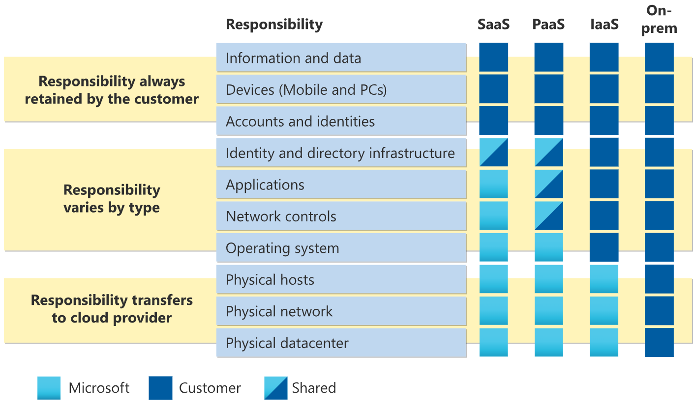
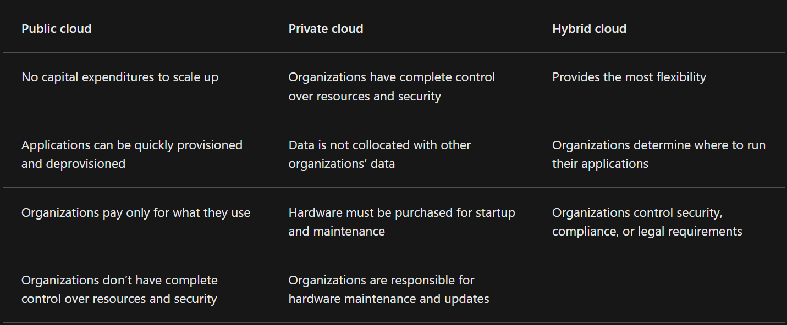
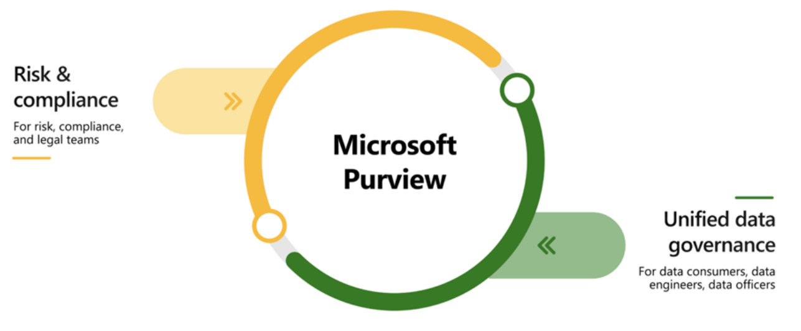

# Describe cloud computing
## [Shared Responsibility Model](https://learn.microsoft.com/en-us/azure/security/fundamentals/shared-responsibility)

## [Cloud Models](https://azure.microsoft.com/en-us/resources/cloud-computing-dictionary/what-are-private-public-hybrid-clouds/)
- [Private Cloud](https://azure.microsoft.com/en-us/resources/cloud-computing-dictionary/what-is-a-private-cloud)
- [Public Cloud](https://cloud.google.com/learn/what-is-public-cloud)
- [Hybrid Cloud](https://azure.microsoft.com/en-us/resources/cloud-computing-dictionary/what-is-hybrid-cloud-computing/)

### [Multi-cloud](https://azure.microsoft.com/en-us/resources/cloud-computing-dictionary/what-is-multi-cloud)
### [Azure Arc](https://learn.microsoft.com/en-us/azure/azure-arc/)
### [Azure VMware Solution](https://learn.microsoft.com/en-us/azure/azure-vmware/introduction)

## [Consumption-based model](https://www.techtarget.com/searchcloudcomputing/definition/consumption-based-pricing-model)
- **[Capital expenditure (CapEx)](https://www.azureguru.org/capex-vs-opex/)**
- **[Operational expenditure (OpEx)](https://www.azureguru.org/capex-vs-opex/)**
- Advantages of Consumption-based model:
  - No upfront costs. 
  - No need to purchase and manage costly infrastructure that users might not use to its fullest potential. 
  - The ability to pay for more resources when they're needed. 
  - The ability to stop paying for resources that are no longer needed.
- [Pay-as-you-go pricing model](https://learn.microsoft.com/en-us/power-platform/admin/pay-as-you-go-overview)
- 

# [Describe features and tools in Azure for governance and compliance](https://learn.microsoft.com/en-us/training/modules/describe-features-tools-azure-for-governance-compliance/)
[Microsoft Purview](https://learn.microsoft.com/en-us/purview/governance-solutions-overview)
- Microsoft Purview's data governance solutions create one place for you to manage your on-premises, multicloud, and software-as-a-service (SaaS) data.
- Two main solution areas comprise Microsoft Purview: risk and compliance and unified data governance.
  - 

[Azure Policy](https://learn.microsoft.com/en-us/azure/governance/policy/overview)
- Enables you to create, assign, and manage policies that control or audit your resources.
- Enables you to define both individual policies and groups of related policies, known as initiatives.
- Azure Policy evaluates your resources and highlights resources that aren't compliant with the policies you've created. 
- Azure Policy can also prevent noncompliant resources from being created.
- Azure Policies can be set at each level, enabling you to set policies on a [specific resource, resource group, subscription](https://learn.microsoft.com/en-us/azure/azure-resource-manager/management/overview), and so on. Additionally, Azure Policies are **inherited**.
- If you have a specific resource that you don’t want Azure Policy to automatically fix, you can flag that resource as an exception – and the policy won’t automatically fix that resource.
- An [Azure Policy initiative](https://techcommunity.microsoft.com/t5/itops-talk-blog/azure-policy-initiatives-vs-azure-policies-when-should-i-use-one/ba-p/1229167) is a way of grouping related policies together.

## Describe the purpose of [resource locks](https://learn.microsoft.com/en-us/azure/azure-resource-manager/management/lock-resources)
- A resource lock prevents resources from being accidentally deleted or changed.
- Resource locks can be applied to [individual resources, resource groups, or even an entire subscription](https://learn.microsoft.com/en-us/azure/azure-resource-manager/management/overview).
- Resource locks are inherited.
- **Types of Resource Locks:**
  - CanNotDelete
  - ReadOnly(CanNotChange)
- You can manage resource locks from the [Azure portal](https://learn.microsoft.com/en-us/azure/azure-portal/azure-portal-overview), [PowerShell](https://learn.microsoft.com/en-us/powershell/azure/what-is-azure-powershell?view=azps-11.6.0), the [Azure CLI](https://learn.microsoft.com/en-us/cli/azure/what-is-azure-cli), or from an [Azure Resource Manager](https://learn.microsoft.com/en-us/azure/azure-resource-manager/management/overview) template.
- Resource locks apply regardless of [RBAC](https://learn.microsoft.com/en-us/azure/role-based-access-control/overview) permissions.
- [Exercise - Configure a resource lock](https://learn.microsoft.com/en-us/training/modules/describe-features-tools-azure-for-governance-compliance/5-exercise-configure-resource-lock)

## Describe the purpose of the [Service Trust portal](https://learn.microsoft.com/en-us/purview/get-started-with-service-trust-portal)
- The Microsoft Service Trust Portal is a portal that provides access to various content, tools, and other resources about Microsoft security, privacy, and compliance practices. 
- The Service Trust Portal contains details about Microsoft's implementation of controls and processes that protect our cloud services and the customer data therein. 
- To access some of the resources on the Service Trust Portal, you must sign in as an authenticated user with your Microsoft cloud services account (Microsoft Entra organization account). You'll need to review and accept the Microsoft non-disclosure agreement for compliance materials.

# [Describe features and tools for managing and deploying Azure resources](https://learn.microsoft.com/en-us/training/modules/describe-features-tools-manage-deploy-azure-resources/)
## [Azure portal](https://learn.microsoft.com/en-us/azure/azure-portal/azure-portal-overview)
- The Azure portal is a web-based, unified console that provides an alternative to command-line tools. With the Azure portal, you can manage your Azure subscription by using a graphical user interface.

## [Azure Cloud Shell](https://learn.microsoft.com/en-us/azure/cloud-shell/overview)
- Azure Cloud Shell is a browser-based shell tool that allows you to create, configure, and manage Azure resources using a shell. 
- Azure Cloud Shell support both Azure PowerShell and the Azure Command Line Interface (CLI), which is a Bash shell.

## [Azure PowerShell](https://learn.microsoft.com/en-us/powershell/azure/what-is-azure-powershell?view=azps-11.6.0)
- Azure PowerShell is a shell with which developers, DevOps, and IT professionals can run commands called command-lets (cmdlets). These commands call the Azure REST API to perform management tasks in Azure. Cmdlets can be run independently to handle one-off changes, or they may be combined to help orchestrate complex actions such as:
  - The routine setup, teardown, and maintenance of a single resource or multiple connected resources.
  - The deployment of an entire infrastructure, which might contain dozens or hundreds of resources, from imperative code.

## [Azure CLI](https://learn.microsoft.com/en-us/cli/azure/what-is-azure-cli)
- The Azure CLI is functionally equivalent to Azure PowerShell, with the primary difference being the syntax of commands. While Azure PowerShell uses PowerShell commands, the Azure CLI uses Bash commands.
- Due to the similarities in capabilities and access between Azure PowerShell and the Bash based Azure CLI, it mainly comes down to which language you’re most familiar with.

## [Azure Arc](https://learn.microsoft.com/en-us/azure/azure-arc/overview)
- Azure Arc simplifies governance and management by delivering a consistent multi-cloud and on-premises management platform.

## [Azure Resource Manager (ARM)](https://learn.microsoft.com/en-us/azure/azure-resource-manager/management/overview)
- Azure Resource Manager (ARM) is the deployment and management service for Azure. 
- It provides a management layer that enables you to create, update, and delete resources in your Azure account. 
- Anytime you do anything with your Azure resources, ARM is involved.
- When a user sends a request from any of the Azure tools, APIs, or SDKs, ARM receives the request. ARM authenticates and authorizes the request. Then, ARM sends the request to the Azure service, which takes the requested action. You see consistent results and capabilities in all the different tools because all requests are handled through the same API.
- With Azure Resource Manager, you can:
  - Manage your infrastructure through declarative templates rather than scripts. A Resource Manager template is a JSON file that defines what you want to deploy to Azure. 
  - Deploy, manage, and monitor all the resources for your solution as a group, rather than handling these resources individually. 
  - Re-deploy your solution throughout the development life-cycle and have confidence your resources are deployed in a consistent state. 
  - Define the dependencies between resources, so they're deployed in the correct order. 
  - Apply access control to all services because RBAC is natively integrated into the management platform. 
  - Apply tags to resources to logically organize all the resources in your subscription. 
  - Clarify your organization's billing by viewing costs for a group of resources that share the same tag.
### [ARM templates](https://learn.microsoft.com/en-us/azure/azure-resource-manager/templates/)
- Infrastructure as a code
- Declarative JSON format

### [Bicep](https://learn.microsoft.com/en-us/azure/azure-resource-manager/bicep/)
- Infrastructure as a code
- While similar to an ARM template, which is written in JSON, Bicep files tend to use a simpler, more concise style.

# [Describe monitoring tools in Azure](https://learn.microsoft.com/en-us/training/modules/describe-monitoring-tools-azure/)
## [Azure Advisor](https://learn.microsoft.com/en-us/azure/advisor/)
- Azure Advisor evaluates your Azure resources and makes recommendations to help improve reliability, security, and performance, achieve operational excellence, and reduce costs.
- Recommendation categories:
  - **Reliability** is used to ensure and improve the continuity of your business-critical applications. 
  - **Security** is used to detect threats and vulnerabilities that might lead to security breaches. 
  - **Performance** is used to improve the speed of your applications. 
  - **Operational Excellence** is used to help you achieve process and workflow efficiency, resource manageability, and deployment best practices. 
  - **Cost** is used to optimize and reduce your overall Azure spending.
## [Azure Service Health](https://learn.microsoft.com/en-us/azure/service-health/)
- Azure Service Health helps you keep track of Azure resource, both your specifically deployed resources and the overall status of Azure.
- Azure service health does this by combining three different Azure services:
  - **Azure Status** is a broad picture of the status of Azure globally. Azure status informs you of service outages in Azure on the Azure Status page. The page is a global view of the health of all Azure services across all Azure regions. It’s a good reference for incidents with widespread impact.
  - **Service Health** provides a narrower view of Azure services and regions. It focuses on the Azure services and regions you're using. This is the best place to look for service impacting communications about outages, planned maintenance activities, and other health advisories because the authenticated Service Health experience knows which services and resources you currently use. You can even set up Service Health alerts to notify you when service issues, planned maintenance, or other changes may affect the Azure services and regions you use.
  - **Resource Health** is a tailored view of your actual Azure resources. It provides information about the health of your individual cloud resources, such as a specific virtual machine instance. Using Azure Monitor, you can also configure alerts to notify you of availability changes to your cloud resources.
## [Azure Monitor](https://learn.microsoft.com/en-us/azure/azure-monitor/overview)
- Azure Monitor is a platform for collecting data on your resources, analyzing that data, visualizing the information, and even acting on the results.
- Azure Monitor can monitor Azure resources, your on-premises resources, and even multi-cloud resources like virtual machines hosted with a different cloud provider.
- [Azure Log Analytics](https://learn.microsoft.com/en-us/azure/azure-monitor/logs/log-analytics-overview)
- [Azure Monitor Alerts](https://learn.microsoft.com/en-us/azure/azure-monitor/alerts/alerts-overview)
- [Application Insights](https://learn.microsoft.com/en-us/azure/azure-monitor/app/app-insights-overview)

